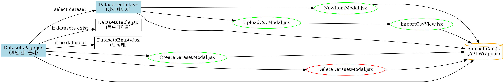
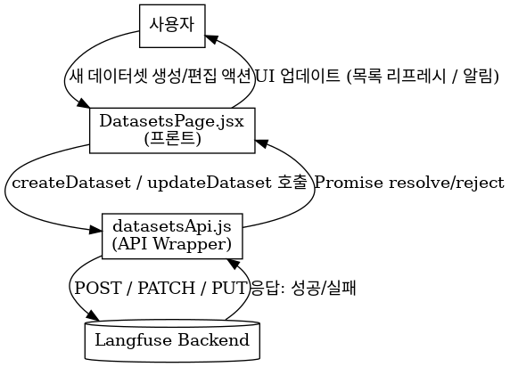
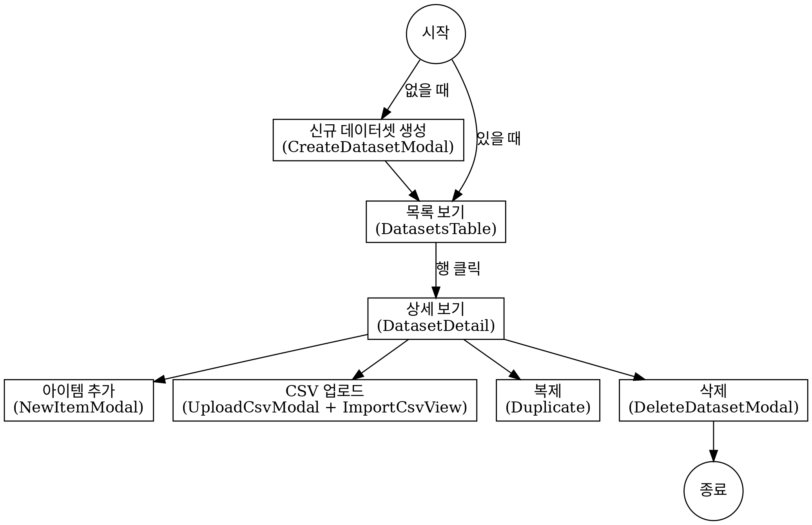
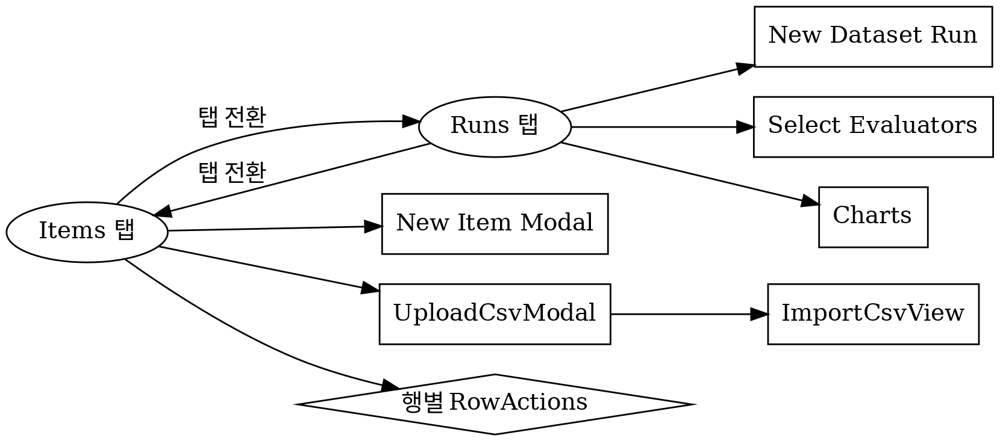
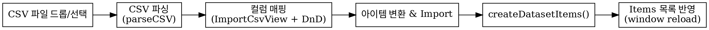
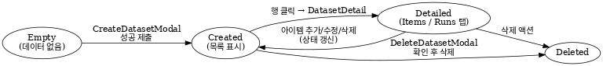

# 🗂️ Evaluation :)
Writer [swallozy](https://github.com/swallozy)

# 🗂️ Evaluation 전체 설명

## 1) 프로젝트 개요 & 아키텍처

- **목표**: Langfuse 스타일의 Evaluation 모듈을 **React 환경**에서 재구현
- **Judge**
    - LLM-as-a-Judge 랜딩 및 평가자 생성 진입점
    - **Create Evaluator** 버튼 → `/llm-as-a-judge/new` 네비게이션
- **Datasets**
    - 평가용 데이터셋의 **생성/수정/복제/삭제/조회**, **아이템 관리**, **CSV 업로드(매핑 포함)**, **Runs** 뷰 기본 UI 제공
- **주요 기술**: React + Vite, CSS Modules, lucide-react(아이콘), react-beautiful-dnd(드래그&드롭), fetch 기반 API 래퍼
- **스타일 전략**: 페이지/컴포넌트 단위의 `.module.css`로 **캡슐화된 스타일** 유지
    - 예: `datasetsTable.module.css`, `datasetDetail.module.css`
    
    
    

## 2) 백엔드 API 규약 (프런트에서 사용)

### 3.0 엔드포인트 한눈에 보기

| 영역 | 메서드 | 경로 | 목적 |
| --- | --- | --- | --- |
| Datasets | GET | `/api/public/v2/datasets` | 데이터셋 목록 조회 |
| Datasets | GET | `/api/public/v2/datasets/:idOrName` | 데이터셋 단건 조회 |
| Datasets | POST | `/api/public/v2/datasets` | 데이터셋 생성 |
| Datasets | PATCH/PUT/POST override | `/api/public/v2/datasets/:idOrName` | 데이터셋 수정(폴백 포함) |
| Datasets | DELETE/POST override | `/api/public/v2/datasets/:idOrName` | 데이터셋 삭제(폴백 포함) |
| Items | GET | `/api/public/dataset-items?datasetName={name}` | 아이템 목록 |
| Items | POST | `/api/public/dataset-items` | 아이템 단건 업서트 |
| Items | DELETE | `/api/public/dataset-items/:itemId` | 아이템 삭제 |
| Runs | GET | `/api/public/datasets/:name/runs` | 실행(Runs) 목록 |



> ✅ 정규화 유틸
> 
- `normalizePayload`: `metadata`가 문자열이어도 JSON/숫자면 파싱 후 전송
- `toArray`: 응답의 `data/items/results/datasets` 중 **배열** 자동 선택

### 2.1 Datasets

**GET** `/api/public/v2/datasets` — *목록 조회*

```bash
curl -X GET "$BASE/api/public/v2/datasets" -H "Authorization: Bearer $TOKEN"

```

**GET** `/api/public/v2/datasets/:idOrName` — *단건 조회*

```bash
curl -X GET "$BASE/api/public/v2/datasets/my-dataset" -H "Authorization: Bearer $TOKEN"

```

**POST** `/api/public/v2/datasets` — *생성*

```bash
curl -X POST "$BASE/api/public/v2/datasets" \
  -H "Authorization: Bearer $TOKEN" -H "Content-Type: application/json" \
  -d '{"name":"my-dataset","description":"optional","metadata":{"team":"nlp"}}'

```

**PATCH/PUT/POST override** `/api/public/v2/datasets/:idOrName` — *수정(폴백 포함)*

```bash
# 1) PATCH
curl -X PATCH "$BASE/api/public/v2/datasets/my-dataset" -H "Authorization: Bearer $TOKEN" \
  -H "Content-Type: application/json" -d '{"description":"new desc"}'

# 2) PUT (폴백 1)
curl -X PUT "$BASE/api/public/v2/datasets/my-dataset" -H "Authorization: Bearer $TOKEN" \
  -H "Content-Type: application/json" -d '{"name":"my-dataset","description":"full"}'

# 3) POST override (헤더 방식)
curl -X POST "$BASE/api/public/v2/datasets/my-dataset" \
  -H "Authorization: Bearer $TOKEN" -H "X-HTTP-Method-Override: PATCH" \
  -H "Content-Type: application/json" -d '{"description":"patched via override"}'

# 4) POST override (쿼리 방식)
curl -X POST "$BASE/api/public/v2/datasets/my-dataset?_method=PATCH" \
  -H "Authorization: Bearer $TOKEN" -H "Content-Type: application/json" \
  -d '{"description":"patched via _method"}'

```

**DELETE/POST override** `/api/public/v2/datasets/:idOrName` — *삭제*

```bash
# 우선 DELETE
curl -X DELETE "$BASE/api/public/v2/datasets/my-dataset" -H "Authorization: Bearer $TOKEN"

# POST override (헤더/쿼리)
curl -X POST  "$BASE/api/public/v2/datasets/my-dataset" -H "Authorization: Bearer $TOKEN" \
  -H "X-HTTP-Method-Override: DELETE"
curl -X POST  "$BASE/api/public/v2/datasets/my-dataset?_method=DELETE" -H "Authorization: Bearer $TOKEN"

```

> ❗ 편집 전략(프런트)
> 
> 
> 안정적 rename 미보장 환경 대비로 **아이템 백업 → 기존 삭제 → 재생성 → 아이템 재삽입**을 사용(아이템 보존 우선).
> 

### 2.2 Dataset Items

**GET** `/api/public/dataset-items?datasetName={name}` — *아이템 목록*

```bash
curl -X GET "$BASE/api/public/dataset-items?datasetName=my-dataset" -H "Authorization: Bearer $TOKEN"

```

**POST** `/api/public/dataset-items` — *단건 업서트*

```bash
curl -X POST "$BASE/api/public/dataset-items" \
  -H "Authorization: Bearer $TOKEN" -H "Content-Type: application/json" \
  -d '{"datasetName":"my-dataset","input":{"q":"..."}, "expectedOutput":"...", "metadata":{"grade":1}}'

```

> NewItemModal 제약:
> 
> - `input/expectedOutput`: **문자열 또는 JSON object**
> - `metadata`: **숫자 또는 JSON object** (문자열 불가)

**DELETE** `/api/public/dataset-items/:itemId` — *단건 삭제*

```bash
curl -X DELETE "$BASE/api/public/dataset-items/it_1" -H "Authorization: Bearer $TOKEN"

```

---

### 2.3 Dataset Runs

**GET** `/api/public/datasets/:name/runs` — *실행 목록 조회*

```bash
curl -X GET "$BASE/api/public/datasets/my-dataset/runs" -H "Authorization: Bearer $TOKEN"

```

## 3) 화면/컴포넌트 구조 & 흐름



### 3.1 Judge (LLM-as-a-Judge)

- 파일: `JudgePage.jsx`, `JudgePage.module.css`
- 핵심: 랜딩 + CTA
    - **Create Evaluator** → `/llm-as-a-judge/new`
    - **Learn More** → 외부 문서 링크
    - 특징 카드(자동화/품질/확장성/성능 추적)

### 3.2 Datasets – 메인(목록) 페이지

- 파일: `DatasetsPage.jsx`
- 기능
    - 마운트 시 목록 로드(`getDatasets`) / 로딩·에러 상태 관리
    - **Create 모달 자동 오픈 트리거**: `/datasets/new`, `?new=1`, `#new`
    - `selected` 있으면 **상세 뷰**, 없으면 **테이블/Empty** 분기
- **편집 핵심 흐름**
    1. 모든 아이템 백업 → 2) 기존 삭제 → 3) 새 payload로 재생성 → 4) 백업분 재삽입
- **복제**: `${name}-copy` 생성 + 아이템 복제 후 목록 리프레시
- **삭제**: `DeleteDatasetModal` 확인 입력 후 하드 삭제
- 보조 UI: `DatasetsEmpty.jsx`, `DatasetsTable.jsx`
- 스타일: `DatasetsPage.module.css`, `datasetsShared.module.css`, `datasetsTable.module.css`, `datasetsEmpty.module.css`

### 3.3 Datasets – 상세 페이지



- 파일: `DatasetDetail.jsx`
- 헤더: `setHeader`로 좌(타이틀/탭)·우(액션) 주입
- 탭: **Runs / Items** (뱃지 포함)
- Items 액션: **New item**, **Upload CSV**, **…**(편집/복제/삭제)
- Runs 액션: **New dataset run**, **Select evaluators**, **Charts**

**(A) Items 탭**

- 빈 상태: 대형 드롭존 + “Click to select a CSV file”
- CSV 파이프라인
    1. 드롭/선택 → `parseCSV`
    2. `ImportCsvView`에서 매핑
    3. `createDatasetItems(name, items)` 일괄 업로드
    4. 성공 알림 후 리로드(현 구현)
- 목록 상태: 8개 컬럼 + `RowActions`(Edit/Archive/Delete 자리)
    - 일부 버튼은 **UI만 자리** (바인딩 필요)

**(B) Runs 탭**

- 열 정의: `Name / Description / Run Items / Latency / Cost / Scores / Created / Metadata / Actions`
- `runs.map(...)` 렌더링 자리 (향후 연동)

**CSV 매핑 상세 (ImportCsvView)**

- 자동 추정: `input/prompt/question`, `expected/output/answer/label`, `metadata/meta/tags`
- DnD: `react-beautiful-dnd` + `StrictDroppable`(React 18 호환)

**단일 아이템 추가 (NewItemModal)**

- 유효성: `input/expectedOutput`(문자열/JSON), `metadata`(숫자/JSON)
- 제출: `api.upsertDatasetItem` 호출 → 성공 콜백

**업로드 모달 (UploadCsvModal)**

- 드롭존 → 파싱 → `ImportCsvView` → `await onImportSuccess(items)` 후 모달 닫기

**삭제 모달 (DeleteDatasetModal)**

- 데이터셋 **정확한 이름** 입력 시에만 활성화, “Deleting…” 진행 표시

**생성/수정 모달 (CreateDatasetModal)**

- 검증: 이름 필수/중복 확인, `metadata`는 JSON/숫자/더블쿼트 문자열 허용
- 접근성: 포커스·ESC·`aria-*`
- 제출: `onSubmit({ name, description, metadata })`

## 4) 사용자 시나리오 (운영 매뉴얼)

### 4.1 데이터셋 만들기

- [ ]  `/datasets` → **New dataset** → 모달 작성 → 생성 → 목록 반영

### 4.2 데이터셋 편집(이름 변경 포함)

- [ ]  행 액션 **… → Edit** → 수정 후 **Save**
- [ ]  내부적으로 **백업→삭제→재생성→재삽입** 전략

### 4.3 복제

- [ ]  **Duplicate** → `${name}-copy` 생성 + 아이템 복제 → 알림

### 4.4 삭제

- [ ]  행 액션 **…** 또는 상세 헤더 **… → Delete**
- [ ]  모달에서 **정확한 이름** 입력 → **Delete dataset**

### 4.5 아이템 추가(단건)

- [ ]  **Items 탭 → New item** → JSON 유효성 통과 → **Add to dataset**

### 4.6 CSV 대량 업로드



- [ ]  **Upload CSV** → 드롭/선택
- [ ]  `ImportCsvView`에서 **Input/Expected/Metadata** 매핑 → **Import**
- [ ]  완료 후 **리로드**로 반영 확인



## 5) 오류 처리, 접근성, UX 메모

> 🚧 오류 처리
> 
> - 현재 `alert(...)` 기반. 운영 전환 시 **토스트/에러바**로 통일 권장
> - `datasetsApi`는 **PATCH/DELETE 다단 폴백**으로 게이트웨이 제약 대비

> ♿ 접근성 & 단축동작
> 
> - `CreateDatasetModal`: `aria-*`, ESC 닫기, 초기 포커스
> - `DatasetDetail`: K/J 네비 키 힌트(UI), 실제 바인딩은 추후

> ✅ React 안정성
> 
> - DnD: `StrictDroppable`로 StrictMode 마운트/언마운트 이슈 방지

---

## 6) 엣지 케이스 & 주의사항

- 편집(이름 변경) = **삭제→재생성** 전략 → 외부에서 **dataset ID를 직접 참조**하는 시스템과의 영향 점검 필요
- CSV 대용량: 메모리 부담 → **스트리밍 파서(PapaParse 등)** 검토
- 메타데이터 스키마: `CreateDatasetModal`(문자열 허용) vs `NewItemModal`(문자열 불가) **정책 통일 필요**
- 리로드 기반 반영 → **상태 갱신 방식**으로 전환 권장
- CORS/Proxy: dev(5173)·backend 포트 충돌 시 **Vite Proxy** 권장

---

## 7) 코드 품질 가이드 (일관성)

- 스타일: **모듈 CSS 고정**, 공통 요소는 `datasetsShared.module.css` 재사용
- 아이콘: **lucide-react 중심**, 커스텀 SVG(`components/icons.jsx`) 병행
- 유틸: `fmtDate`, `normalizePayload`, `metaToStr` 등 **재사용**

---

## 8) 테스트 체크리스트 (핵심)

- **Datasets**
    - [ ]  목록 로딩/에러 표시
    - [ ]  생성(중복/빈값/메타데이터 오류)
    - [ ]  편집(이름 변경 포함) 후 **아이템 보존**
    - [ ]  복제 시 아이템까지 복제
    - [ ]  삭제 모달 이름 정확히 입력할 경우만 활성화
- **Items**
    - [ ]  단건 추가 유효성(문자열/JSON, 숫자)
    - [ ]  CSV 업로드 → 자동 추정 → 수동 재배치 → Import → 반영
    - [ ]  `RowActions` 외부 클릭 닫힘
- **Runs**
    - [ ]  빈 상태/헤더/푸터 UI
    - [ ]  향후 데이터 연동 렌더링
- **Judge**
    - [ ]  `/llm-as-a-judge/new` 이동
    - [ ]  문서 링크/feature 카드 확인

---

## 9) 향후 과제 로드맵

- [ ]  **Judge** 평가자 생성/실행 로직
- [ ]  **Runs 탭** 고도화(응답 스키마 반영, 필터/페이징)
- [ ]  **CSV 대용량**: 스트리밍 파서, 진행률/에러 리포트
- [ ]  **에러/토스트** 체계 표준화
- [ ]  **검색/필터/컬럼 설정** 상태 저장/복원
- [ ]  **접근성/i18n** 고도화

## 10) 파일 맵 & 참조
```
📦 Evaluation
├─ 📁 DataSets
│  ├─ 📁 components
│  │  ├─ 🧩 CreateDatasetModal.jsx
│  │  ├─ 🧩 DatasetDetail.jsx
│  │  ├─ 🧩 DatasetsEmpty.jsx
│  │  ├─ 🧩 DatasetsTable.jsx
│  │  ├─ 🧩 DeleteDatasetModal.jsx
│  │  ├─ 🧩 ImportCsvView.jsx
│  │  ├─ 🧩 NewItemModal.jsx
│  │  ├─ 🧩 RowActions.jsx
│  │  ├─ 🧩 StrictDroppable.jsx
│  │  ├─ 🧩 UploadCsvModal.jsx
│  │  └─ 🧩 icons.jsx
│  ├─ 📄 DatasetsPage.jsx
│  ├─ ⚙️ datasetsApi.js
│  ├─ 🎨 DatasetsPage.module.css
│  ├─ 🎨 datasetDetail.module.css
│  ├─ 🎨 datasetsEmpty.module.css
│  ├─ 🎨 datasetsShared.module.css
│  ├─ 🎨 datasetsTable.module.css
│  ├─ 🎨 createDatasetModal.module.css
│  ├─ 🎨 deleteDatasetModal.module.css
│  ├─ 🎨 importCsvView.module.css
│  ├─ 🎨 newItemModal.module.css
│  ├─ 🎨 rowActions.module.css
│  └─ 🎨 uploadCsvModal.module.css
└─ 📁 Judge
├─ 📄 JudgePage.jsx
└─ 🎨 JudgePage.module.css
작은 범례:

🧩 컴포넌트(JSX) / 📄 페이지 파일

⚙️ API 래퍼(JS)

🎨 CSS Module

📁 폴더 / 📦 루트
```
🔎 파일별 import 매트릭스


| 파일 | import된 패키지 |
| --- | --- |
| CreateDatasetModal.jsx | `react` |
| DatasetDetail.jsx | `react`, `react-router-dom`, `lucide-react` |
| DatasetsEmpty.jsx | `react` |
| DatasetsPage.jsx | `react`, `react-router-dom` |
| DatasetsTable.jsx | `react`, `lucide-react` |
| DeleteDatasetModal.jsx | `react`, `lucide-react` |
| ImportCsvView.jsx | `react`, `react-beautiful-dnd`, `lucide-react` |
| JudgePage.jsx | `react-router-dom` *(JSX 자동 런타임이라 `react` 미표기 가능)* |
| NewItemModal.jsx | `react`, `lucide-react` |
| RowActions.jsx | `react`, `lucide-react` |
| StrictDroppable.jsx | `react`, `react-beautiful-dnd` |
| UploadCsvModal.jsx | `react`, `lucide-react` |
| datasetsApi.js | *(외부 패키지 import 없음)* |
| icons.jsx | `react` |

---

# 🚧 미완성/보류 현황 (WIP Notice)

> ⚠️ 현 상태 요약
> 
> 
> • **구현 완료**: Datasets 목록/생성/삭제, CSV 매핑·업로드(기본 흐름), 상세 화면 기본 탭 구조
> 
> • **미완성**: Judge 생성 플로우, Runs 데이터 바인딩/테이블 기능, Items 고급 테이블/편집/Export, 대용량 Import UX
> 

---

## 1) Judge

**현재**

- 랜딩(소개) + CTA 버튼 구성.
- **Create Evaluator** → `/llm-as-a-judge/new` 네비게이션만 제공.

**미완성**

- 평가자 **생성 폼/유효성/저장 로직** 미구현.
- 평가 실행 트리거/결과 집계/리포트 UI 미구현.

**다음 단계**

- 생성 폼 스키마 정의 → 클라이언트 검증 → 저장 API 연동.
- 실행 트리거 및 결과 수집 후 Runs와 연동.

---

## 2) Datasets — **Runs 탭**

**현재**

- 테이블 **헤더/레이아웃**만 존재.

**미완성**

- `listDatasetRuns()` **데이터 바인딩 미적용** (`runs.map` 자리만 있음).
- **페이징/정렬/필터/검색** 미구현.
- 상단 액션: **New dataset run / Select evaluators / Charts**는 **UI 자리만 있음**(동작 없음).
- 실행 상세/드릴다운(행 클릭 상세) 미구현.

**다음 단계**

- 데이터 바인딩 → 빈 상태/에러 상태 처리 → 기본 페이징 도입.
- 필터(기간/모델/점수 범위) 및 정렬(최신, 점수) 추가.
- 차트(점수/비용/지연시간) 기본형 바인딩.

---

## 3) Datasets — **Items 탭**

**RowActions**

- **Edit**: 모달로 불러와 저장까지 **미연결**(초안 UI만).
- **Archive**: `status=archived` 전환 로직 **미구현**(서버 스펙 미정).
- **Delete**: **단건 삭제**는 연결(204 허용), **Bulk Delete 없음**.

**테이블 기능**

- **정렬/필터/검색/컬럼 토글/리사이즈**: **UI 자리이거나 미구현**.
- **페이지네이션**: 일부 화면에서 동작 미완(데이터 연동 필요).
- **Export**: CSV/JSON 내보내기 버튼은 **자리만 있음**.

**CSV Import**

- 업로드 후 **`window.location.reload()`*로 반영 → **상태 갱신 방식 미적용**.
- **대용량 처리(스트리밍, 진행률, 부분 실패 리포트, 롤백)** 미구현.
- **중복/머지** 전략(동일 키 덮어쓰기 등) 미정.
- **드라이런(미리보기/유효성 리포트)** 미구현.

**아이템 편집 UX**

- **인라인 편집** 미구현(현재 단건 추가 모달만).
- **메타데이터 스키마 불일치**:
    - `CreateDatasetModal` → 문자열 허용(더블쿼트 필요)
    - `NewItemModal` → **숫자/객체만 허용**
        
        → **정책 통일 필요**.
        

**접근성/키보드**

- 상단 K/J 네비 힌트만 있고 **실제 키 바인딩 미구현**.

**성능**

- `createDatasetItems()`가 **무제한 병렬(Promise.all)** → 대용량에서 브라우저 부하 가능.

---

## 4) 공통 보류

- **에러/알림**: `alert(...)` 사용 → **토스트/에러바 표준화** 미완.
- **캐시/ETag(304)**: 응답 캐싱/무효화 전략 **개선 작업 중**.
- **i18n**: 문구/라벨 분리 미완.
- **CORS/프록시**: dev(5173)·백엔드 포트 충돌 시 가이드만 있고, **자동 프록시 설정 스크립트는 미포함**.

---

## 5) 위험요소 & 의존성

- **이름 변경 전략**: 서버 rename 안정성 미보장 전제 → **아이템 백업 → 기존 삭제 → 재생성 → 재삽입**.
    
    → 외부 시스템이 **dataset ID를 하드 참조**하면 영향 가능(사전 커뮤니케이션 필요).
    
- **대용량 CSV**: 메모리 피크/브라우저 잠김 가능 → 스트리밍 파서/동시성 제한 필요.

---

## 6) 운영 체크리스트(트러블슈팅)

- [ ]  콘솔에 `[Datasets API] BASE = ...` 로그 확인.
- [ ]  dev(5173)와 BASE 포트가 **동일**이면 `.env` 또는 Vite proxy 수정.
- [ ]  인증은 **Basic(PK/SK)** 또는 **Bearer** 중 **하나만** 사용.
- [ ]  CSV 매핑 자동 추정 실패 시 `ImportCsvView`에서 **수동 DnD**로 보정.
- [ ]  `metadata` 문자열이면 JSON/숫자로 **정규화** 후 업로드.

---

## 7) 우선순위 로드맵

**P0 (즉시)**

- [ ]  Runs: `listDatasetRuns()` **바인딩** + 기본 페이징/빈 상태/에러 처리.
- [ ]  Items: **Edit** 모달 연결 + **Export(CSV)** 1차 구현.
- [ ]  Import 후 **페이지 리로드 제거** → 상태 갱신으로 전환.
- [ ]  **토스트 시스템** 도입(성공/실패/경고/정보).

**P1 (다음 주차)**

- [ ]  Items: **Archive 상태/필터** + **Bulk Actions**.
- [ ]  Import: **스트리밍/진행률/부분 실패 리포트/드라이런**.
- [ ]  표: **정렬/필터/컬럼 토글/리사이즈** + 상태 저장/복원.
- [ ]  접근성/i18n: 라벨 분리, 키보드 네비(실제 바인딩).

---

## 8) 완료된 범위(Reference)

- Datasets: **목록/생성/삭제** 주요 플로우, **복제(아이템 포함)**, **CSV 매핑·업로드(기본)**
- 상세 화면: **Runs/Items 탭 구조**, 헤더/액션 버튼 자리, 모달 기본 UX
- API 래퍼: **PATCH/DELETE 폴백 체인**, **payload 정규화**(`normalizePayload`), **배열 추출**(`toArray`), **인증 헤더 자동화**